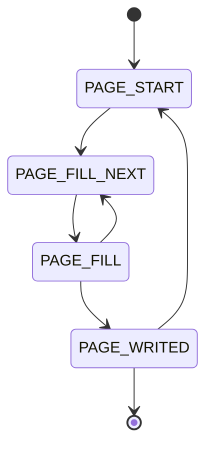

# H9 Frames
### CAN 2.0B Identifier

| Bit |    28    | 27 - 23 | 22 - 18 |    17 - 09     |  08 - 00  |
|-----|:--------:|:-------:|:-------:|:--------------:|:---------:|
|     | priority |  type   | seqnum  | destination_id | source_id |

### H9 Frames type

| ID  | Type name              |         Seqnum         | Response frame               |
|-----|------------------------|:----------------------:|------------------------------|
 | 0   | NOP                    |           -            | -                            |
 | 1   | PAGE_START             |      next number       | PAGE_FILL_NEXT               |
 | 2   | QUIT_BOOTLOADER        |      next number       | NODE_TURNED_ON               |
 | 3   | PAGE_FILL              |      next number       | PAGE_WRITED / PAGE_FILL_NEXT |
 | 4   | BOOTLOADER_TURNED_ON   |        always 0        | PAGE_START                   |
 | 5   | PAGE_FILL_NEXT         |  same as in the query  | PAGE_FILL                    |
 | 6   | PAGE_WRITED            |  same as in the query  |                              |
 | 7   | PAGE_FILL_BREAK        |  same as in the query  |                              |
 | 8   | SET_REG                |      next number       | REG_EXTERNALLY_CHANGED       |
 | 9   | GET_REG                |      next number       | REG_VALUE                    |
 | 10  | SET_BIT                |      next number       | REG_EXTERNALLY_CHANGED       | 
 | 11  | CLEAR_BIT              |      next number       | REG_EXTERNALLY_CHANGED       | 
 | 12  | TOGGLE_BIT             |      next number       | REG_EXTERNALLY_CHANGED       | 
 | 13  | NODE_UPGRADE           |      next number       | BOOTLOADER_TURNED_ON         | 
 | 14  | NODE_RESET             |      next number       | NODE_TURNED_ON               | 
 | 15  | DISCOVER               |      next number       | NODE_INFO                    | 
 | 16  | REG_EXTERNALLY_CHANGED |  same as in the query  | -                            | 
 | 17  | REG_INTERNALLY_CHANGED |  same as in the query  | -                            | 
 | 18  | REG_VALUE_BROADCAST    |  same as in the query  | -                            | 
 | 19  | REG_VALUE              |  same as in the query  | -                            | 
 | 20  | ERROR                  |  same as in the query  | -                            | 
 | 21  | NODE_HEARTBEAT         |  same as in the query  | -                            | 
 | 22  | NODE_INFO              |  same as in the query  | -                            | 
 | 23  | NODE_TURNED_ON         |        always 0        | -                            | 
 | 24  | NODE_SPECIFIC_BULK0    |      next number       | -                            | 
 | 25  | NODE_SPECIFIC_BULK1    |      next number       | -                            | 
 | 26  | NODE_SPECIFIC_BULK2    |      next number       | -                            | 
 | 27  | NODE_SPECIFIC_BULK3    |      next number       | -                            | 
 | 28  | NODE_SPECIFIC_BULK4    |      next number       | -                            | 
 | 29  | NODE_SPECIFIC_BULK5    |      next number       | -                            | 
 | 30  | NODE_SPECIFIC_BULK6    |      next number       | -                            | 
 | 31  | NODE_SPECIFIC_BULK7    |      next number       | -                            | 

### Bootloader

